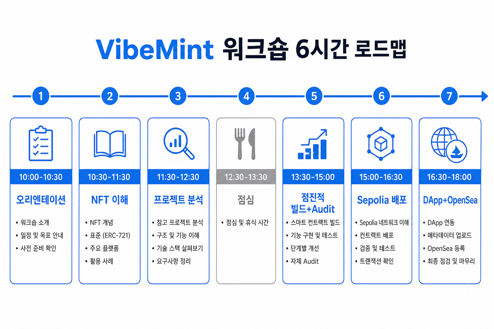
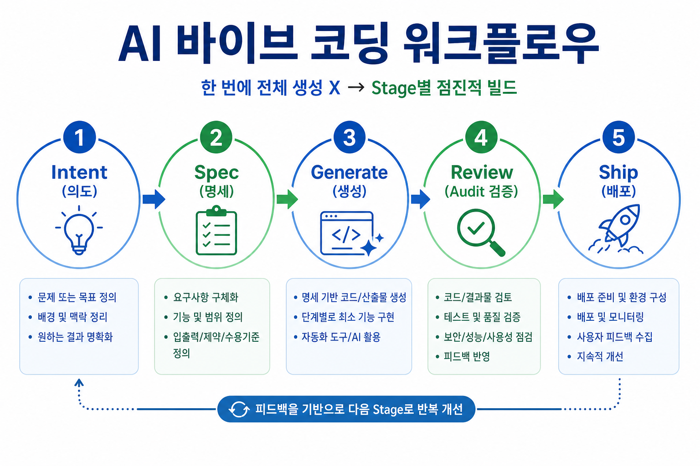
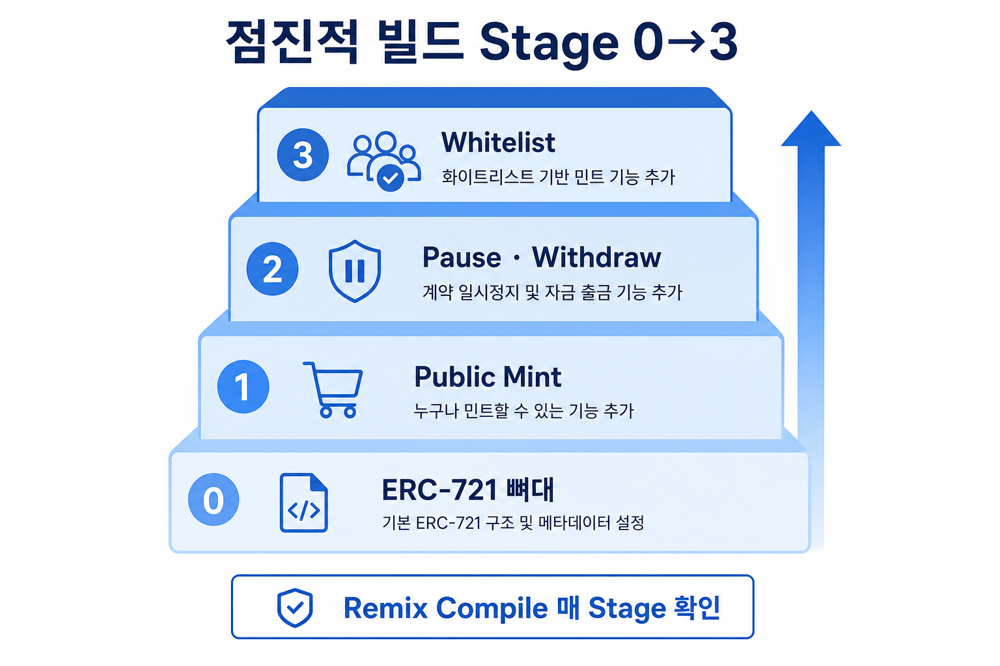
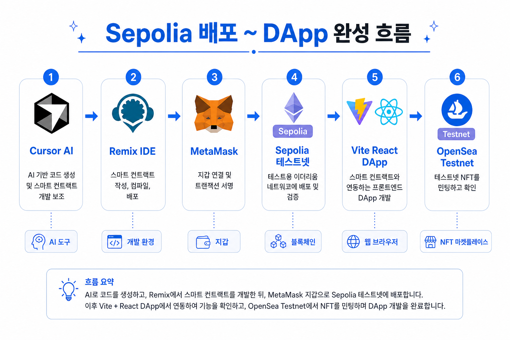

# 강사 진행 스크립트 (6시간 · 2026 · AI 바이브 코딩)

주최측 시간표 기준 **목표 · 진행 · 체크포인트**입니다. 세부 분량은 현장 상황에 맞게 조절하세요.

---

## 3차시 구성 (한눈에 보기)

| 차시 | 대제목 | 소제목 |
| --- | --- | --- |
| **1차시** | **AI 바이브 코딩으로 이해하는 NFT · Spec 설계** | ① 오리엔테이션 · ② NFT·ERC 이해 · ③ Spec 설계 |
| **2차시** | **점진적 빌드로 만드는 NFT 컨트랙트 · AI Audit** | ① Remix·규칙 · ② Stage 0→3 빌드 · ③ AI 보안 Audit |
| **3차시** | **Sepolia 배포와 NFT DApp · OpenSea** | ① Sepolia 배포·mint · ② 프론트 DApp · ③ OpenSea·마무리 |

차시·소제목 발표 그림: [../presentation/images/](../presentation/images/) · [../presentation/README.md](../presentation/README.md)

| 차시 | 워크플로우 | 핵심 이미지 |
| --- | --- | --- |
| 1차시 | Intent → Spec | [워크플로우](images/isgrs-workflow.png) |
| 2차시 | Generate → Review | [Stage 0→3](images/stage-build-flow.png) |
| 3차시 | Ship | [배포 흐름](images/deploy-dapp-flow.png) |

---

# 1차시 — AI 바이브 코딩으로 이해하는 NFT · Spec 설계

**목표**: 바이브 코딩 워크플로우 이해 + NFT 개념 + VibeMint Spec 확정  
**워크플로우**: **Intent → Spec**

### 1차시 소제목 (3)

1. **오리엔테이션** — 강사·환경 안내, AI 바이브 코딩(Intent→Spec→Generate→Review→Ship), VibeMint 목표와 MetaMask·Cursor·Sepolia 사전 준비 점검
2. **NFT·ERC 이해** — 대체 가능/불가능, ERC-721 vs ERC-1155, OpenZeppelin 구조, Cursor AI로 스마트 컨트랙트 역분석
3. **Spec 설계** — 유명 NFT 프로젝트(BAYC·Azuki) 벤치마킹, Spec 템플릿·AI 명세 작성, 오후 실습용 VibeMint Spec 확정

---

## 1-1. 오리엔테이션 — 바이브 코딩 워크플로우와 사전 준비

**목표**: 당일 로드맵·워크플로우·실습 환경 이해

**진행**
1. 강사 소개, Wi-Fi, Q&A 채널
2. AI 바이브 코딩 개념 · Intent→…→Ship 그림 설명 (iExec 등 사례)
3. 오늘의 결과물: VibeMint NFT DApp on Sepolia
4. [pre-course-checklist.md](../pre-course-checklist.md) 점검

**체크포인트**
- [ ] MetaMask + Sepolia 네트워크
- [ ] Cursor 로그인

---

## 1-2. NFT·ERC 이해 — 개념·표준·AI 역분석

**목표**: NFT와 ERC-721을 설명하고, AI로 컨트랙트를 읽을 수 있다

**진행**
1. NFT 핵심 (대체 가능/불가능, 온체인·오프체인) → [01-nft-concepts.md](../student/01-nft-concepts.md)
2. ERC-721 vs ERC-1155 · OpenZeppelin (Ownable·Pausable)
3. Cursor 역분석 실습 → [01-reverse-engineer.md](../prompts/01-reverse-engineer.md)
4. Q&A

**체크포인트**
- [ ] mint / owner / pause 역할 설명 가능

---

## 1-3. Spec 설계 — 벤치마킹과 VibeMint 명세 확정

**목표**: 오후 Generate에 쓸 Spec을 확정한다

**진행**
1. BAYC, Azuki 등 민팅·화이트리스트·supply 구조
2. Spec 템플릿 → [02-spec-writing.md](../student/02-spec-writing.md)
3. [02-spec-generator.md](../prompts/02-spec-generator.md) 실습 · Spec 공유

**체크포인트**
- [ ] maxSupply, mintPrice, per-wallet cap, whitelist in Spec

### 1차시 마무리 한 줄

> Intent·Spec까지 확정. 다음은 코드를 **한 단계씩** 만든다.

---

## 점심

---

# 2차시 — 점진적 빌드로 만드는 NFT 컨트랙트 · AI Audit

**목표**: Stage 0→3 점진적 빌드 + 배포 전 보안 Audit  
**워크플로우**: **Generate → Review**

### 2차시 소제목 (3)

1. **Remix·AI 규칙** — 00-rules(한 번에 전체 생성 금지), Remix VM 환경, Compile·Deploy·Read/Write 사용법
2. **Stage 0→3 점진적 빌드** — 뼈대→mint→pause/withdraw→whitelist를 Cursor·Remix로 기능별 추가·컴파일 검증
3. **AI 보안 Audit** — 배포 전 Critical/High 취약점 점검·수정, Review 없이 Ship 하지 않기

---

## 2-1. Remix·AI 규칙 — Generate 준비

**목표**: AI 규칙과 Remix 연습 환경을 맞춘다

**진행**
1. [00-rules.md](../prompts/00-rules.md) — Stage diff만, OpenZeppelin만
2. Remix VM vs Injected Provider · 파란/주황 버튼 · Value(ether)
3. → [03-stage-build/README.md](../prompts/03-stage-build/README.md)

---

## 2-2. Stage 0→3 점진적 빌드 — 기능별 컨트랙트 완성

**목표**: Incremental prompt로 NFT 컨트랙트를 완성한다

**진행**
1. Stage 0 뼈대 → [stage-0.md](../prompts/03-stage-build/stage-0.md)
2. Stage 1 public mint → [stage-1.md](../prompts/03-stage-build/stage-1.md)
3. Stage 2 pause · ownerMint · withdraw → [stage-2.md](../prompts/03-stage-build/stage-2.md)
4. Stage 3 whitelist → [stage-3.md](../prompts/03-stage-build/stage-3.md)
5. 상세: [03-incremental-build.md](../student/03-incremental-build.md)

**체크포인트**
- [ ] Remix Stage 3 compile OK

**시간 부족 시**: Stage 3 생략 → `contracts/solution/` 참고

---

## 2-3. AI 보안 Audit — 배포 전 Review

**목표**: Critical/High 0건까지 수정한다

**진행**
1. [04-security-audit.md](../prompts/04-security-audit.md) 실행
2. Critical/High만 diff 수정 · Remix 재컴파일
3. 버퍼

**체크포인트**
- [ ] Audit Critical/High 0건

### 2차시 마무리 한 줄

> 컨트랙트 완성 + **Audit(Review) 없이 배포하지 않는다.**

---

# 3차시 — Sepolia 배포와 NFT DApp · OpenSea

**목표**: Sepolia 배포 · mint · 민팅 DApp · OpenSea 확인  
**워크플로우**: **Ship**

### 3차시 소제목 (3)

1. **Sepolia 배포·mint** — Faucet, Injected Provider 배포, setBaseURI, 테스트 mint, Etherscan 확인, 멀티체인 개념 소개
2. **프론트 DApp** — `.env`에 컨트랙트 주소 연결, npm run dev, MetaMask Connect·Mint
3. **OpenSea·마무리** — 테스트넷 마켓에서 NFT 조회, Q&A, 메인넷 전문 Audit 고지

---

## 3-1. Sepolia 배포·mint — 테스트넷에 올리고 검증

**목표**: Injected Provider로 Sepolia 배포 + mint + Etherscan

**진행**
1. Faucet으로 Sepolia ETH
2. Remix Environment = **Injected Provider - MetaMask** → Deploy · 주소 저장
3. `setBaseURI` · (선택) whitelist
4. Value 0.001 ether → mint · Etherscan 확인
5. 멀티체인 개념 (L1 vs L2, 당일은 Sepolia)
6. → [04-deploy-sepolia.md](../student/04-deploy-sepolia.md)

**체크포인트**
- [ ] Etherscan Sepolia contract
- [ ] 1회 mint 성공
- [ ] Contract Address 저장

---

## 3-2. 프론트 DApp — MetaMask 민팅 UI

**목표**: 브라우저에서 Connect Wallet → Mint

**진행**
1. `frontend/starter` · `.env`에 배포 주소
2. `npm install` · `npm run dev`
3. Connect Wallet → Mint (0.001 ETH)
4. → [05-frontend-mint.md](../student/05-frontend-mint.md)

**체크포인트**
- [ ] Connect Wallet → Mint

---

## 3-3. OpenSea·마무리 — 마켓 확인과 수업 정리

**목표**: 테스트넷에서 NFT를 확인하고 워크플로우를 닫는다

**진행**
1. testnets.opensea.io (인덱싱 지연 안내)
2. (선택) UI 보완 프롬프트
3. 마무리 Q&A · 메인넷 전문 Audit 고지

**체크포인트**
- [ ] OpenSea testnet 또는 Etherscan으로 확인

### 3차시 마무리 한 줄

> 테스트넷에 **Ship** 완료. Intent → Spec → Generate → Review → Ship 전 구간을 하루 만에 경험.

---

## 마무리 멘트 (필수)

> 오늘 코드는 **Sepolia 테스트넷 교육용**입니다. 메인넷 배포 전 **전문 Audit** 필수. AI는 주니어처럼 쓰되 **Review(Audit)는 생략하지 마세요.**

---

## 차시 · 소제목 ↔ 학습 자료

| 차시 | 소제목 | 수강생 문서 |
| --- | --- | --- |
| 1차시 | 1-1 오리엔테이션 | [pre-course-checklist](../pre-course-checklist.md) |
| 1차시 | 1-2 NFT·ERC 이해 | [01-nft-concepts](../student/01-nft-concepts.md) |
| 1차시 | 1-3 Spec 설계 | [02-spec-writing](../student/02-spec-writing.md) |
| 2차시 | 2-1 Remix·AI 규칙 | [03-stage-build/README](../prompts/03-stage-build/README.md) |
| 2차시 | 2-2 Stage 0→3 빌드 | [03-incremental-build](../student/03-incremental-build.md) |
| 2차시 | 2-3 AI 보안 Audit | [04-security-audit](../prompts/04-security-audit.md) |
| 3차시 | 3-1 Sepolia 배포·mint | [04-deploy-sepolia](../student/04-deploy-sepolia.md) |
| 3차시 | 3-2 프론트 DApp | [05-frontend-mint](../student/05-frontend-mint.md) |
| 3차시 | 3-3 OpenSea·마무리 | [00-walkthrough Part 7](../student/00-walkthrough.md) |

전체 따라하기: [00-walkthrough.md](../student/00-walkthrough.md)

---

## 이미지 파일 위치

| 파일 | 용도 |
| --- | --- |
| [images/workshop-timeline.png](images/workshop-timeline.png) | 수업 시작·전체 소개 |
| [images/isgrs-workflow.png](images/isgrs-workflow.png) | 1차시 워크플로우 |
| [images/stage-build-flow.png](images/stage-build-flow.png) | 2차시 Stage 실습 |
| [images/deploy-dapp-flow.png](images/deploy-dapp-flow.png) | 3차시 배포·DApp |

PPT에 넣을 때: `docs/instructor/images/` 폴더에서 그대로 삽입 가능
