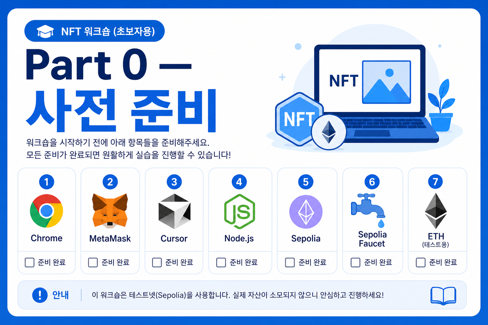
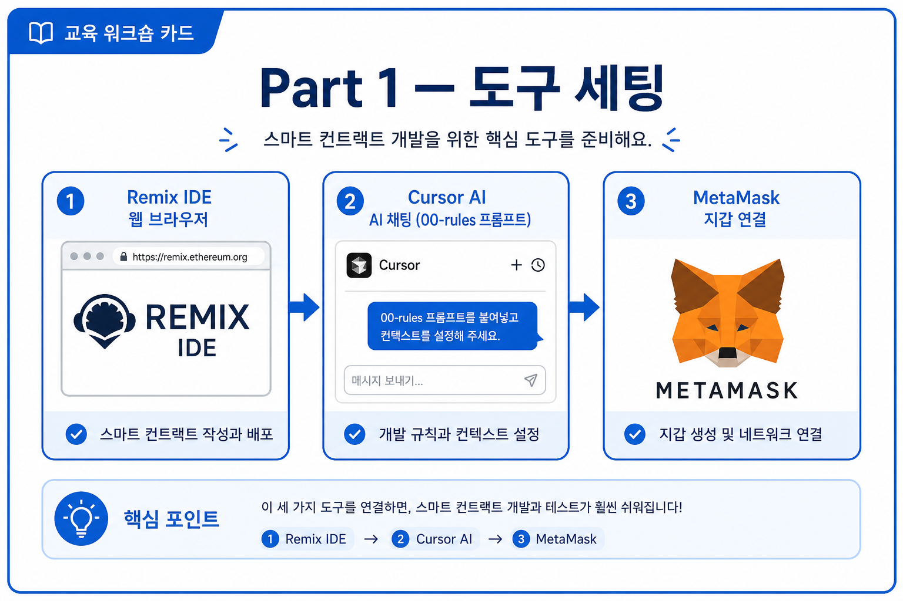
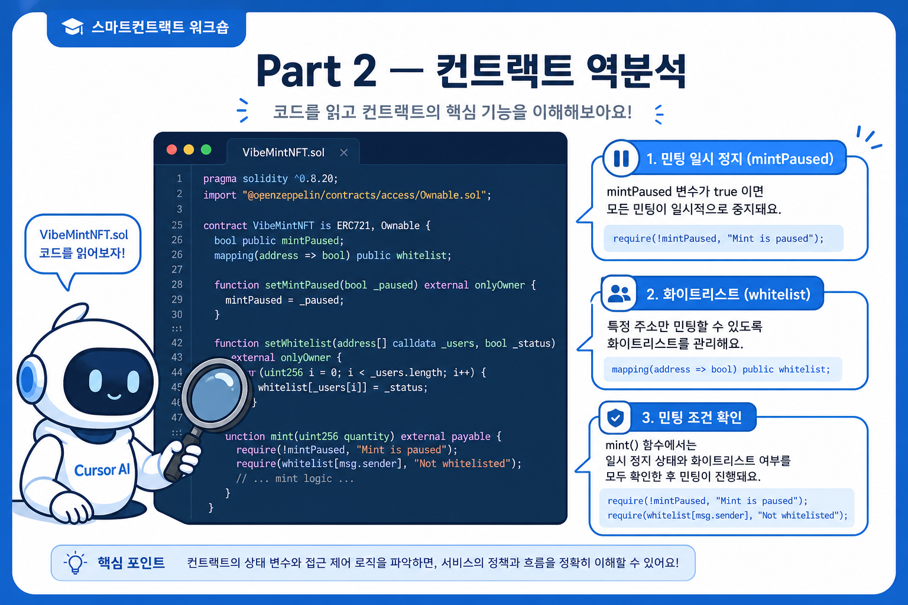
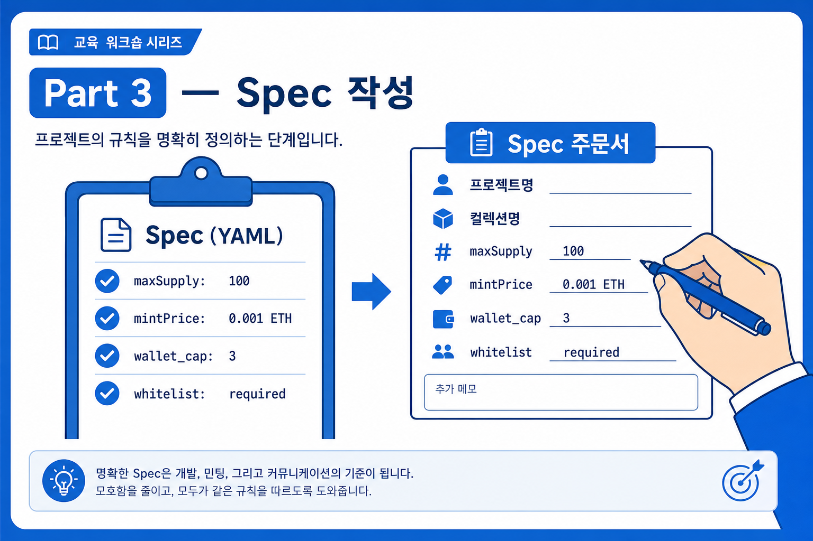
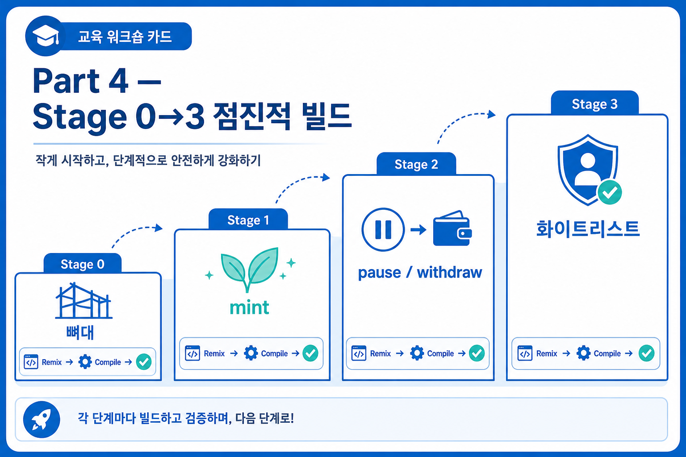
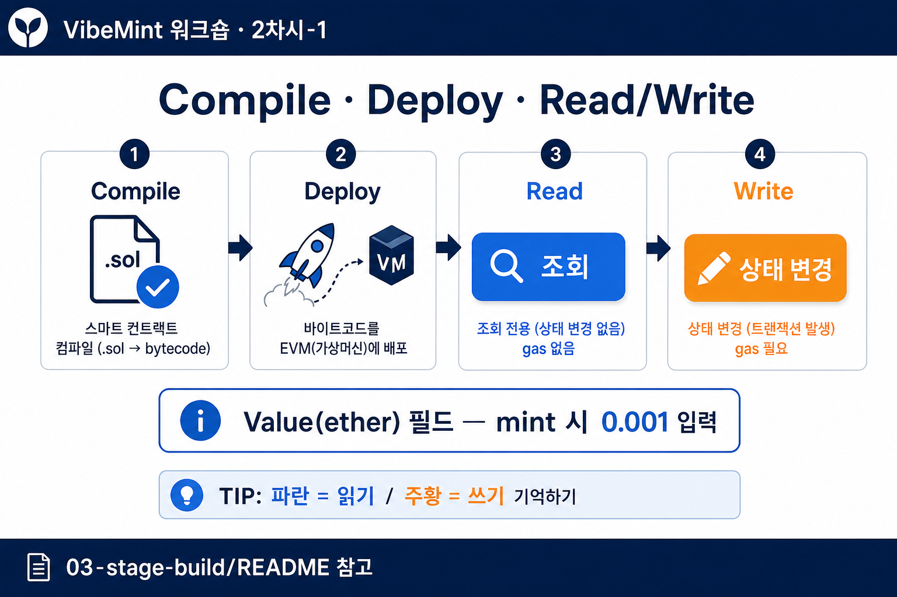
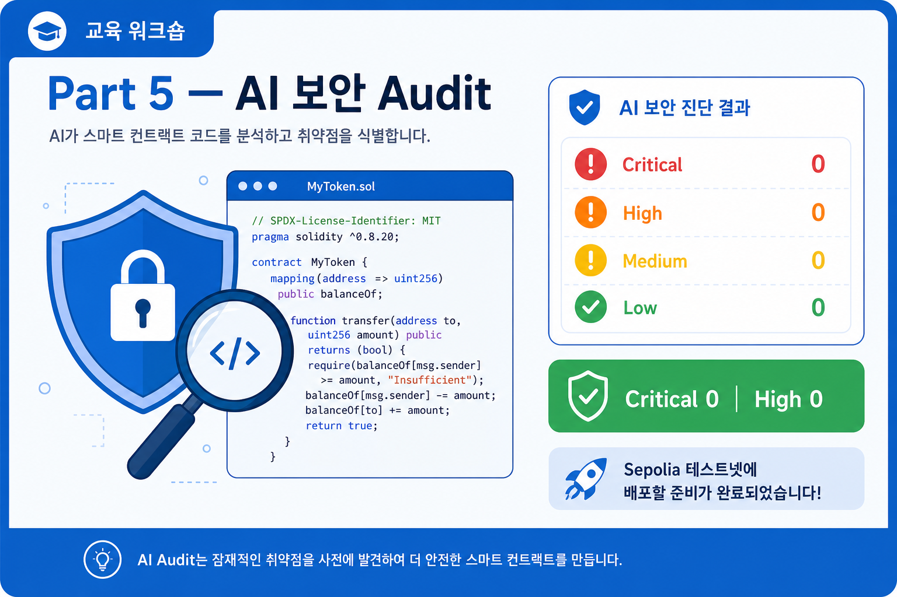
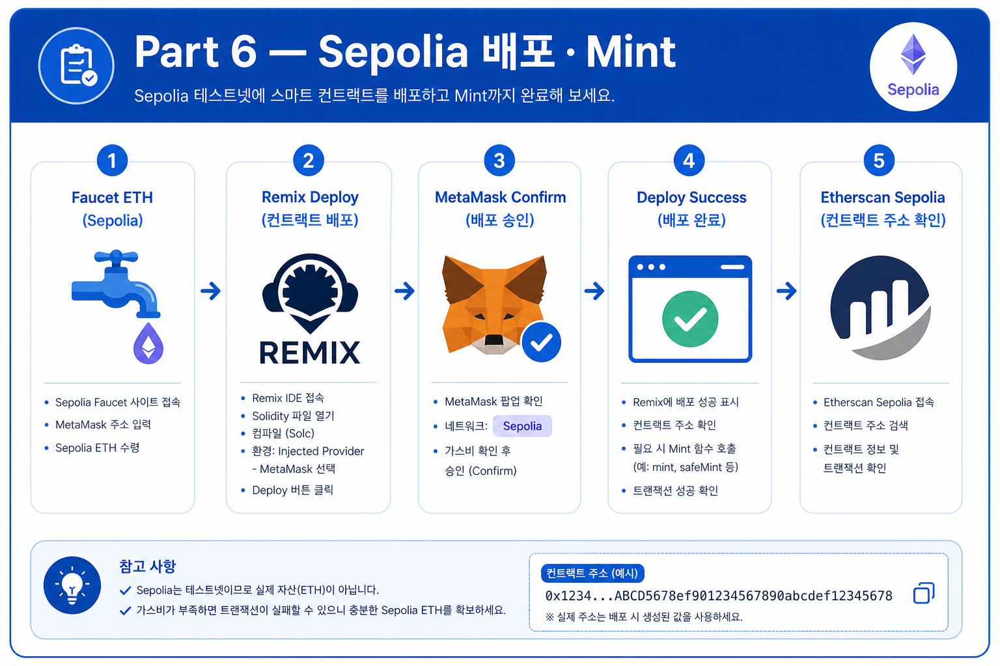
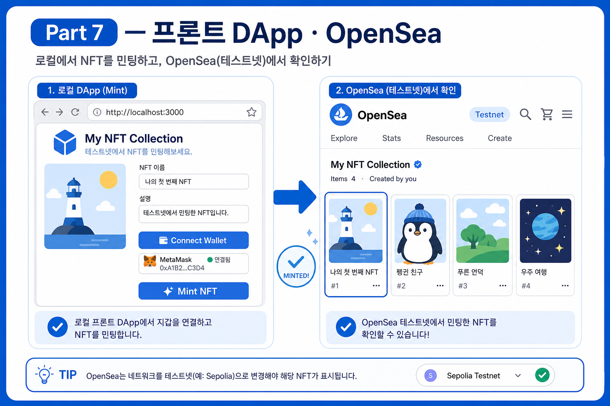

# VibeMint 실습 — 한 단계씩 따라하기

**메인 테마**: 쉽게 이해하고 빠르게 AI 바이브 코딩으로 만들어 보는 NFT

이 문서 하나만 순서대로 따라하면 **Sepolia 테스트넷 NFT DApp**을 끝까지 완성할 수 있습니다.  
각 단계 끝의 **체크**를 확인한 뒤 다음으로 넘어가세요.

> 테스트넷 교육용입니다. 메인넷 배포 전 전문 Audit 필수.

---

## 진행 요약

| Part | 내용 | 대략 시간 |
| --- | --- | --- |
| 0 | 사전 준비 | 수업 전 |
| 1 | Cursor · Remix · MetaMask 세팅 | 10분 |
| 2 | 컨트랙트 역분석 | 20분 |
| 3 | Spec 작성 | 20분 |
| 4 | Stage 0 → 3 컨트랙트 빌드 | 60분 |
| 5 | AI 보안 Audit | 15분 |
| 6 | Sepolia 배포 · mint | 40분 |
| 7 | 프론트 DApp · NFT 확인 | 40분 |

---

## Part 0 — 사전 준비 (수업 전)



### Step 0-1. 노트북·브라우저

- [ ] 개인 노트북 + 충전기
- [ ] Google Chrome 설치

### Step 0-2. MetaMask (메타마스크) 설치 + Sepolia 토큰 받기

#### A. MetaMask 설치·지갑 생성

1. Chrome 웹 스토어에서 **MetaMask** 확장 프로그램 설치  
   → [chromewebstore.google.com — MetaMask](https://chromewebstore.google.com/detail/metamask/nkbihfbeogaeaoehlefnkodbefgpgknn)
2. **지갑 생성** (Create a new wallet)
3. 비밀번호 설정
4. **시드 구문(Secret Recovery Phrase)은 절대 공유·캡처·채팅에 올리지 마세요.** 개인 메모장에만 보관

#### B. Sepolia(세폴리아) 네트워크 추가

1. MetaMask 상단 네트워크 드롭다운 → **Show test networks** 켜기 (설정에 있을 수 있음)
2. 네트워크 목록에서 **Sepolia** 선택  
   목록에 없으면 직접 추가:
   - 네트워크 이름: `Sepolia`
   - RPC URL: `https://rpc.sepolia.org`
   - Chain ID: `11155111`
   - 통화 기호: `ETH`
3. 상단에 **Sepolia**가 표시되는지 확인

#### C. Sepolia 테스트 ETH(토큰) 받기 — Faucet(파우셋)

배포·mint에 필요한 **무료 테스트 ETH**를 받습니다. (실제 돈 아님)

1. MetaMask에서 **Sepolia** 선택
2. 계정 주소 복사 (상단 계정명 클릭 → Copy address)
3. Faucet 중 **하나** 접속해 주소 붙여넣고 요청:

| Faucet | 링크 | 비고 |
| --- | --- | --- |
| Alchemy Sepolia Faucet | [alchemy.com/faucets/ethereum-sepolia](https://www.alchemy.com/faucets/ethereum-sepolia) | 계정 로그인 필요할 수 있음 |
| Sepolia PoW Faucet | [sepolia-faucet.pk910.de](https://sepolia-faucet.pk910.de/) | 브라우저에서 PoW 채굴 후 수령 |

4. MetaMask **Sepolia** 잔액이 `0`보다 커질 때까지 대기 (1~몇 분)
5. **0.05 ETH 이상**이면 수업 실습에 충분 (배포 gas + mint 0.001 + 여유)

> Faucet이 막히면: 다른 Faucet 시도 · 일일 한도 확인 · 수업 당일 강사에게 요청

- [ ] MetaMask 설치 및 지갑 생성 완료
- [ ] Sepolia 네트워크 선택됨
- [ ] Sepolia ETH 잔액 확인 (0보다 큼)

### Step 0-3. Cursor

1. [cursor.com](https://cursor.com/)에서 설치
2. 회원가입 후 **로그인**

- [ ] Cursor 로그인 완료

### Step 0-4. Node.js

1. [nodejs.org](https://nodejs.org/) — LTS **v20+** 설치
2. 터미널에서 확인: `node -v`

- [ ] Node.js v20+ 확인

### Step 0-5. 교육 저장소 받기

저장소: [https://github.com/uno-gilbert/VIBE-MINT](https://github.com/uno-gilbert/VIBE-MINT)

**방법 A — Git clone (권장)**

```bash
git clone https://github.com/uno-gilbert/VIBE-MINT.git vibe-mint
cd vibe-mint
```

**방법 B — ZIP 다운로드 (Git이 없을 때)**

1. [github.com/uno-gilbert/VIBE-MINT](https://github.com/uno-gilbert/VIBE-MINT) 접속  
2. 초록 **Code** 버튼 → **Download ZIP**  
3. 압축 해제 (폴더 이름 예: `VIBE-MINT-main`)  
4. 터미널에서 해당 폴더로 이동:

```bash
cd ~/Downloads/VIBE-MINT-main
```

(압축을 푼 실제 경로에 맞게 `cd` 하세요.)

Cursor에서 **File → Open Folder**로 위 프로젝트 폴더를 엽니다.

- [ ] Cursor에서 프로젝트 폴더 열림

---
## Part 1 — 도구 세팅 (수업 시작)



### Step 1-1. Remix IDE 열기

1. Chrome에서 [remix.ethereum.org](https://remix.ethereum.org) 접속  
2. **처음 사용 시** 회원 가입·로그인이 필요할 수 있습니다.  
   - 화면의 **Sign in / Login / Connect** 안내를 따름  
   - GitHub·Google·email 등 Remix가 제시하는 방식 중 하나로 계정 생성  
   - 이미 계정이 있으면 **로그인**만 하면 됩니다  
3. (선택) 튜토리얼·팝업이 뜨면 Skip / Close로 닫아도 실습에 지장 없습니다  
4. 왼쪽 **File Explorer** → `contracts` 폴더 → `VibeMintNFT.sol` 새 파일 생성  

> Remix는 브라우저 IDE라 설치는 없지만, **계정으로 워크스페이스가 저장**되는 경우가 많습니다.  
> 수업 전에 한 번 접속해 가입까지 끝내 두면 Part 4부터 시간이 덜 급합니다.

- [ ] Remix 계정 준비(가입·로그인) 완료  
- [ ] Remix에서 `VibeMintNFT.sol` 파일 생성

### Step 1-2. AI 공통 규칙 붙여넣기

1. Cursor 채팅 새로 열기
2. `docs/prompts/00-rules.md` 내용 **전체 복사** → 첫 메시지에 붙여넣기

앞으로 Cursor에 코드 요청할 때마다 이 규칙을 함께 사용합니다.

- [ ] 00-rules 프롬프트 준비 완료

---

## Part 2 — 컨트랙트 역분석 (이해하기)



### Step 2-1. 완성본 미리 보기

1. Cursor에서 `contracts/solution/VibeMintNFT.sol` 열기
2. `docs/prompts/01-reverse-engineer.md` 프롬프트 복사
3. 채팅에 `@VibeMintNFT.sol` 멘션 + 프롬프트 붙여넣기 → 실행

- [ ] AI 역분석 결과 확인 (mint, pause, whitelist 역할 이해)

### Step 2-2. 스스로 확인

아래를 한 문장씩 설명할 수 있으면 OK:

- [ ] ERC-721 vs ERC-1155 차이
- [ ] `maxSupply`, `mintPrice` 역할
- [ ] `pause()`가 켜지면 mint가 막히는 이유

---

## Part 3 — Spec 작성 (주문서 만들기)



### Step 3-1. Spec 초안 생성

1. `docs/prompts/02-spec-generator.md` 프롬프트를 Cursor에 붙여넣기
2. 출력된 YAML Spec을 메모장에 저장

### Step 3-2. Spec 검증

아래 항목이 Spec에 있는지 확인:

- [ ] maxSupply: 100
- [ ] mintPrice: 0.001 ETH
- [ ] 지갑당 mint 최대 3개
- [ ] pause / withdraw / whitelist 조건

---

## Part 4 — Stage 0 → 3 점진적 빌드



**규칙**: 한 번에 전체 코드를 만들지 않습니다. Stage마다 **추가분만** 요청합니다.

### 따라하기 (권장)

아래 **Stage README를 한 단계씩** 열어서 체크리스트를 완료하세요.

→ **[contracts/stages/README.md](../../contracts/stages/README.md)** ← Stage 0부터 순서대로

| Stage | 따라하기 문서 |
| --- | --- |
| 0 뼈대 | [stage-0-base/README.md](../../contracts/stages/stage-0-base/README.md) |
| 1 mint | [stage-1-mint/README.md](../../contracts/stages/stage-1-mint/README.md) |
| 2 pause·withdraw | [stage-2-access/README.md](../../contracts/stages/stage-2-access/README.md) |
| 3 whitelist | [stage-3-whitelist/README.md](../../contracts/stages/stage-3-whitelist/README.md) |

각 Stage 공통: Cursor 프롬프트 → Remix **메뉴 ①→④** (File → Compiler → Deploy → Read/Write) → **0.8.31 · EVM osaka** → **Remix VM Deploy** → README 테스트.  
Remix 상세·PPT: [03-stage-build/README.md](../prompts/03-stage-build/README.md) ·   
(`mcopy not found` → Compiler **0.8.31** + EVM **osaka** 확인. import `@5.1.0` 확인)


시간 부족 시 Stage 3 생략 → `contracts/solution/VibeMintNFT.sol` 가능 (Audit은 필수).

- [ ] Stage 0 Compile · 테스트 완료
- [ ] Stage 1 mint 테스트 완료
- [ ] Stage 2 pause / withdraw 테스트 완료
- [ ] Stage 3 whitelist 완료 (또는 solution)

---

## Part 5 — AI 보안 Audit (배포 전 필수)



### 이 Part에서 하는 일 (한 줄)

컨트랙트를 Sepolia에 올리기 **전에**, AI에게 「보안 검사」를 시키고 **위험한 버그를 고칩니다.**

워크플로우에서 여기가 **Review** 단계입니다.

```text
Intent → Spec → Generate(Stage 0~3) → ★ Review(Audit) → Ship(배포)
```

> AI가 짠 코드는 **맞아 보여도** 구멍이 있을 수 있습니다.  
> 「일단 배포」하지 말고, **Audit 한 번**을 습관으로 만드세요.

---

### Audit이란? (쉽게)

| 용어 | 의미 |
| --- | --- |
| **Audit** | 코드에 보안·로직 문제가 없는지 **점검**하는 것 |
| **Severity** | 심각도 (Critical > High > Medium > Low) |
| **Critical / High** | 돈·권한이 위험 — **반드시 수정** |
| **Medium / Low** | 개선 권장 — 수업에서는 기록·선택 수정 |

#### AI Audit이 보는 것 (예)

| 검사 | 질문 |
| --- | --- |
| Access control | owner만 되는 함수에 구멍이 있나? |
| Reentrancy | withdraw가 중간에 다시 공격당할 수 있나? |
| Mint 경제 | 가격·maxSupply·지갑당 3개 검증이 빠졌나? |
| Pause | pause 중에도 mint가 되나? |

---

### Step 5-1. Audit 실행

1. Cursor에서 **최종** `VibeMintNFT.sol` 열기  
   (Stage 3 결과 또는 `contracts/solution/VibeMintNFT.sol`)
2. 채팅에 `@VibeMintNFT.sol` 멘션
3. [docs/prompts/04-security-audit.md](../prompts/04-security-audit.md)의 **복붙용 프롬프트** 전체를 붙여넣기
4. AI가 **표 형식 findings**를 줄 때까지 기다림  
   (아직 코드를 고치지 말고 **리포트만** 받는 것이 원칙)

#### 리포트에서 볼 줄

| Severity | 의미 | 수업 기준 |
| --- | --- | --- |
| Critical | 치명적 | **0건** 될 때까지 수정 |
| High | 높음 | **0건** (또는 강사 확인 후 수정) |
| Medium / Low | 중간·정보 | 가능하면 수정, 시간 없으면 메모 |

- [ ] Audit 리포트(표)를 받음
- [ ] Critical / High 개수를 메모함

---

### Step 5-2. 수정 + 재컴파일

Critical·High가 **1건이라도** 있으면:

1. Cursor에 이어서 요청 (또는 04-security-audit의 **수정 프롬프트**):

```text
위 Audit의 Critical/High 항목만 수정하세요.
전체 파일 재작성 금지. 변경 diff만 주세요.
```

2. 변경된 코드를 Remix에 반영
3. **Compile** 다시 (0.8.31 · EVM osaka)
4. (권장) Remix VM에서 mint / pause / withdraw **짧게 재테스트**

- [ ] Critical 0건, High 0건
- [ ] Remix 최종 Compile 성공

---

### Part 5에서 이해하는 것

| 포인트 | 내용 |
| --- | --- |
| Review를 빼면 안 됨 | 바이브 코딩의 핵심 리스크 관리 |
| AI Audit ≠ 전문 Audit | 교육·테스트넷용. **메인넷은 전문가 필수** |
| 전체 재작성 금지 | 버그 고칠 때도 Stage처럼 **diff만** |

**다음**: Audit 통과한 코드로 → Part 6 Sepolia 배포

---

## Part 6 — Sepolia(세폴리아) 배포 · Mint



### 이 Part에서 하는 일 (한 줄)

연습장(Remix VM)이 아니라 **실제 테스트넷 Sepolia**에 컨트랙트를 올리고, **진짜 테스트 ETH**로 mint합니다.

| 비교 | Remix VM (Stage 0~3) | Sepolia (Part 6) |
| --- | --- | --- |
| 어디? | 브라우저 가짜 체인 | 이더리움 **테스트 네트워크** |
| ETH | 가짜 | Faucet **테스트 ETH** |
| MetaMask | 불필요 | **필수** |
| Environment | Remix VM | **Injected Provider** |

**비유**: VM = 집 안 연습, Sepolia = 연습용 공도로 (실제 돈은 아님).

---

### Step 6-1. 테스트 ETH 받기 (Faucet · 파우셋)

Part 0에서 이미 받았다면 잔액만 확인하세요.

1. MetaMask 상단 네트워크 → **Sepolia**
2. 주소 복사
3. Faucet 중 하나:
   - [Alchemy Sepolia Faucet](https://www.alchemy.com/faucets/ethereum-sepolia)
   - [Sepolia PoW Faucet](https://sepolia-faucet.pk910.de/)
4. MetaMask Sepolia 잔액이 **0.05 ETH 이상**이면 여유 있음  
   (최소 배포 gas + mint 0.001)

> 메인넷(이더리움)으로 바꾸지 마세요. **Sepolia만** 사용합니다.

- [ ] Sepolia ETH 잔액 확인 (0보다 큼)

---

### Step 6-2. 컨트랙트 배포 (Injected Provider)

1. Remix에서 **최종 Compile** 성공 확인
2. **Deploy & Run Transactions**
3. **Environment**를 바꿉니다:

| 바꾸기 전 | 바꾸기 후 |
| --- | --- |
| Remix VM | **Injected Provider - MetaMask** |

4. MetaMask 팝업 → **연결 승인**
5. MetaMask·Remix 모두 **Sepolia**인지 확인
6. Contract = `VibeMintNFT` → **Deploy**
7. MetaMask에서 **가스비 확인 후 Confirm**
8. 아래 Deployed Contracts에 나타나면 성공

#### 반드시 저장

컨트랙트 주소 예: `0xAbCd...1234`

- 메모장에 복사
- 나중에 프론트 `.env`에 사용
- Etherscan: `https://sepolia.etherscan.io/address/주소`

| 실패 증상 | 해결 |
| --- | --- |
| Wrong network | MetaMask를 Sepolia로 |
| insufficient funds | Faucet으로 ETH 충전 |
| User rejected | Deploy 다시 → Confirm |
| 여전히 Remix VM | Environment를 Injected Provider로 |

- [ ] Sepolia에 배포됨
- [ ] Contract Address 저장함

---

### Step 6-3. 배포 후 설정 (owner)

배포한 지갑 = **owner**. Deployed Contracts에서:

#### A. `setBaseURI` (권장)

1. 주황색 `setBaseURI`
2. 입력: `https://example.com/metadata/`
3. **transact** → MetaMask Confirm

교육용 URL이어도 mint·배포 실습에는 문제 없습니다.

#### B. `setWhitelist` (선택)

```text
accounts: ["0x내주소"]
allowed: true
```

→ transact → `whitelist(내주소)`가 `true`인지 확인

---

### Step 6-4. 테스트 Mint

1. Deploy 패널 **Value** = `0.001` ether (Remix 소수 버그 시 wei `1000000000000000` — [04-deploy-sepolia.md](04-deploy-sepolia.md#eth-단위-ether--gwei--wei))
2. 주황색 `mint` → **transact**
3. MetaMask **승인** (가스 + 0.001 ETH)
4. 파란색 확인:
   - `totalMinted` → `1`
   - `ownerOf(0)` → 내 주소

| 실패 | 원인 |
| --- | --- |
| Insufficient payment | Value 0 또는 부족 → **0.001 ether** (wei `1000000000000000`) |
| insufficient funds (want 3 ETH…) | Value **3** 잘못 입력 → **0.001** ether |
| Public mint disabled | `setPublicMintEnabled(true)` 필요 |
| ETH 부족 | Faucet 재충전 |

- [ ] Sepolia에서 mint 1회 성공

---

### Step 6-5. Etherscan 확인

브라우저:

```text
https://sepolia.etherscan.io/address/여기에_컨트랙트_주소
```

| 볼 것 | 의미 |
| --- | --- |
| Contract Creation | 배포 트랜잭션 |
| mint tx | 민팅 기록 |
| Token 탭 (있을 수 있음) | NFT 전송 기록 |

- [ ] Etherscan에서 배포·mint 확인

---

### Part 6에서 이해하는 것

| 포인트 | 내용 |
| --- | --- |
| Injected Provider | MetaMask → **실넷(테스트넷)** 연결 |
| 주소 저장 | 프론트·Etherscan의 열쇠 |
| Sepolia ≠ 메인넷 | 테스트 ETH만, 실제 자산 아님 |

**다음**: 배포 주소로 → Part 7 민팅 사이트

---

## Part 7 — 프론트 DApp · NFT 확인



### 이 Part에서 하는 일 (한 줄)

Remix 버튼 대신, **웹페이지(민팅 사이트)**에서 MetaMask로 mint하고, **Etherscan·MetaMask**에서 NFT를 확인합니다.

```text
브라우저 DApp  →  MetaMask 승인  →  Sepolia 컨트랙트 mint  →  Etherscan / MetaMask에서 확인
```

---

### Step 7-1. 환경 변수 설정

터미널에서 프로젝트 폴더로 이동:

```bash
cd frontend/starter
cp .env.example .env
```

`.env` 파일을 에디터로 열어 **한 줄**만 고칩니다.

```text
VITE_CONTRACT_ADDRESS=0x여기에_Part6_배포주소
```

| 주의 | |
| --- | --- |
| `0x`로 시작 | Remix에서 복사한 주소 그대로 |
| 따옴표 | 보통 **없이** 입력 |
| 저장 후 | 아래 `npm run dev`를 **다시** 실행해야 반영되는 경우 많음 |

- [ ] `.env`에 Sepolia 컨트랙트 주소 입력

---

### Step 7-2. DApp 실행

```bash
npm install
npm run dev
```

| 명령 | 의미 |
| --- | --- |
| `npm install` | 필요한 라이브러리 설치 (처음 한 번, 시간 좀 걸림) |
| `npm run dev` | 로컬 웹서버 실행 |

터미널에 `http://localhost:5173` 비슷한 주소가 나오면 Chrome으로 엽니다.

> **Chrome + MetaMask** 사용. (다른 브라우저면 확장 프로그램이 없을 수 있음)

- [ ] 로컬 DApp 페이지가 열림

---

### Step 7-3. Connect · Mint

1. 페이지에서 **Connect Wallet** (또는 Connect MetaMask) 클릭  
2. MetaMask 팝업 → **연결 승인**  
3. 네트워크가 Sepolia가 아니면:
   - 화면의 **Switch to Sepolia** 또는 MetaMask에서 Sepolia로 변경  
4. **Mint (0.001 ETH)** 클릭  
5. MetaMask에서 금액·가스 확인 → **Confirm**  
6. 잠시 후 성공 메시지 / tx 링크 확인  

| 화면 | 의미 |
| --- | --- |
| Connect | 사이트 ↔ 지갑 연결 |
| Mint | 프론트가 컨트랙트 `mint()` 호출 |
| Success | Sepolia에 mint tx 포함됨 |

#### 자주 막히는 곳

| 증상 | 해결 |
| --- | --- |
| `.env` 주소 잘못됨 | Part 6 주소 다시 확인, dev 서버 재시작 |
| Wrong network | Sepolia로 전환 |
| mint 실패 | Sepolia ETH 부족, publicMintEnabled, 이미 3개 mint |
| Connect 안 됨 | Chrome + MetaMask, 페이지 새로고침 |

- [ ] 브라우저 DApp에서 mint 성공

---

### Step 7-4. (선택) UI 보완

시간이 되면:

1. [docs/prompts/05-frontend-connect.md](../prompts/05-frontend-connect.md)로 Cursor에 UI 개선 요청  
   (발행량 표시, Etherscan 링크 등)
2. 또는 `frontend/solution/` 과 비교

필수는 아닙니다. **Connect → Mint 성공**이면 Part 7 핵심은 달성입니다.

---

### Step 7-5. mint한 NFT 확인 (Etherscan)

> **OpenSea 테스트넷 종료 (2025-07-24)** — `testnets.opensea.io`는 더 이상 Sepolia NFT를 표시하지 않습니다.  
> [05-frontend-mint.md §8](05-frontend-mint.md#8-mint한-nft-확인하기) 참고.

1. mint tx 해시로 Etherscan 확인:

```text
https://sepolia.etherscan.io/tx/{TX_HASH}
```

2. 컨트랙트 · NFT 페이지 (첫 mint → tokenId `0`):

```text
https://sepolia.etherscan.io/nft/{CONTRACT_ADDRESS}/0
```

3. (선택) MetaMask **NFTs** 탭 → Sepolia → Import NFT

> Etherscan mint tx Success + `ownerOf(0)` = 내 주소면 **민팅 성공**입니다.

- [ ] Etherscan에서 mint tx · 소유 확인

---

### Step 7-6. (선택) OpenSea Studio — 메인넷 발행 다음 단계

> Sepolia VibeMint는 [OpenSea Studio](https://opensea.io/studio)에 **표시되지 않습니다**.  
> 수업 **마지막** 또는 **수업 후** 참고용입니다.

| 오늘 (Sepolia) | Studio (메인넷) |
| --- | --- |
| 컨트랙트 + DApp 직접 개발 | 크리에이터 UI로 컬렉션·드롭 발행 |
| Etherscan으로 확인 | [opensea.io](https://opensea.io) 컬렉션 페이지 |

1. [opensea.io/studio](https://opensea.io/studio) 접속 → 지갑 연결  
2. Create → 체인·이미지·metadata·가격 설정  
3. 메인넷 배포 전 **전문 Audit** 필수  

상세: [05-frontend-mint.md §9](05-frontend-mint.md#9-수업-후--opensea-studio로-nft-발행-선택)

---

### Part 7에서 이해하는 것

| 포인트 | 내용 |
| --- | --- |
| DApp | 지갑 + 컨트랙트를 잇는 **웹 UI** |
| `.env` 주소 | 「어느 컨트랙트에 mint할지」 지정 |
| Etherscan | Sepolia mint·소유 **확인** (OpenSea testnet 종료 후 기본 도구) |
| OpenSea Studio | **메인넷** 발행·드롭 도구 — Sepolia 실습 NFT와 **무관** ([Studio](https://opensea.io/studio)) |
| Ship 완료 | Intent→…→Review→**Ship** 워크플로우 완주 |

---

## 완료 체크리스트

| # | 항목 | 완료 |
| --- | --- | --- |
| 1 | Stage 3(또는 solution) 컴파일 | ☐ |
| 2 | AI Audit Critical/High 0 | ☐ |
| 3 | Sepolia 배포 | ☐ |
| 4 | mint 1회 이상 | ☐ |
| 5 | 프론트 Connect + Mint | ☐ |

---

## 막혔을 때 (Part 5~7 포함)

| 증상 | 해결 |
| --- | --- |
| Remix 컴파일 오류 | Compiler **0.8.31** + EVM **osaka**. import는 `@openzeppelin/contracts@5.1.0/...` |
| MetaMask Wrong network | Sepolia(11155111) 선택 |
| Faucet 안 됨 | PoW Faucet 또는 강사에게 요청 |
| AI가 전체 코드 재작성 | 00-rules + "해당 항목만 / Stage N diff만" |
| mint 실패 | ETH 부족, publicMintEnabled, Value 0.001 **ether** |
| 프론트 mint 실패 | `.env` 주소, `npm run dev` 재시작, Sepolia |
| OpenSea testnet | **2025-07-24 종료** — Etherscan으로 확인 |

상세 FAQ: [docs/instructor/troubleshooting.md](../instructor/troubleshooting.md)

---

## 다음에 읽을 문서 (심화)

| 주제 | 문서 |
| --- | --- |
| NFT 개념 | [01-nft-concepts.md](01-nft-concepts.md) |
| Spec 상세 | [02-spec-writing.md](02-spec-writing.md) |
| Stage 빌드 상세 | [03-incremental-build.md](03-incremental-build.md) |
| Remix·Stage 확인 | [../prompts/03-stage-build/README.md](../prompts/03-stage-build/README.md) |
| 배포 상세 | [04-deploy-sepolia.md](04-deploy-sepolia.md) |
| 프론트 상세 | [05-frontend-mint.md](05-frontend-mint.md) |
| OpenSea Studio (메인넷 발행) | [05-frontend-mint.md §9](05-frontend-mint.md#9-수업-후--opensea-studio로-nft-발행-선택) · [opensea.io/studio](https://opensea.io/studio) |
| 보안 Audit 프롬프트 | [../prompts/04-security-audit.md](../prompts/04-security-audit.md) |

---

## Part별 이미지

| Part | 그림 |
| --- | --- |
| 0 사전 준비 | [walkthrough-part-0.png](images/walkthrough-part-0.png) |
| 1 도구 세팅 | [walkthrough-part-1.png](images/walkthrough-part-1.png) |
| 2 역분석 | [walkthrough-part-2.png](images/walkthrough-part-2.png) |
| 3 Spec 작성 | [walkthrough-part-3.png](images/walkthrough-part-3.png) |
| 4 Stage 빌드 | [walkthrough-part-4.png](images/walkthrough-part-4.png) |
| 5 AI Audit | [walkthrough-part-5.png](images/walkthrough-part-5.png) |
| 6 Sepolia 배포 | [walkthrough-part-6.png](images/walkthrough-part-6.png) |
| 7 DApp · NFT 확인 | [walkthrough-part-7.png](images/walkthrough-part-7.png) |

**축하합니다!** Intent → Spec → Generate → **Review** → Ship 워크플로우를 직접 완주하셨습니다.
