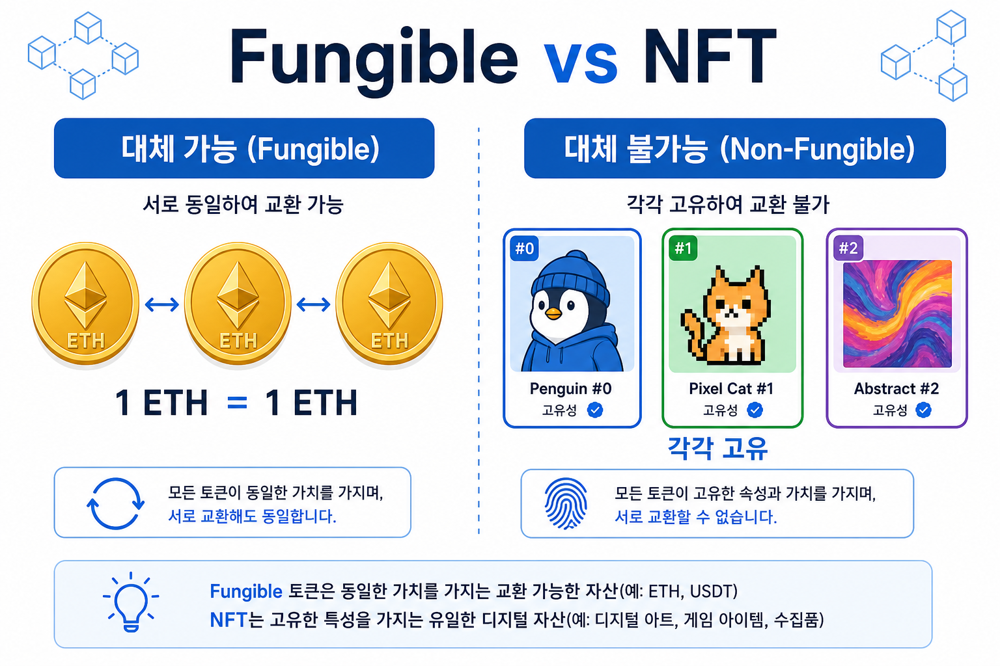
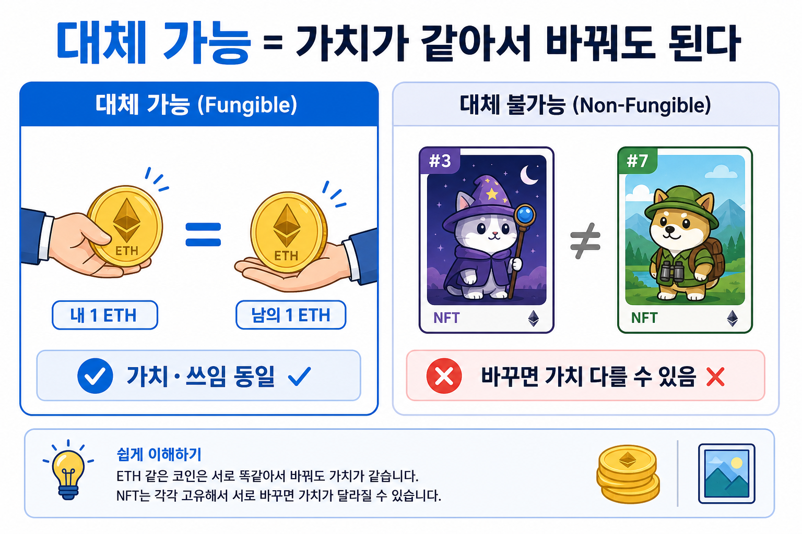
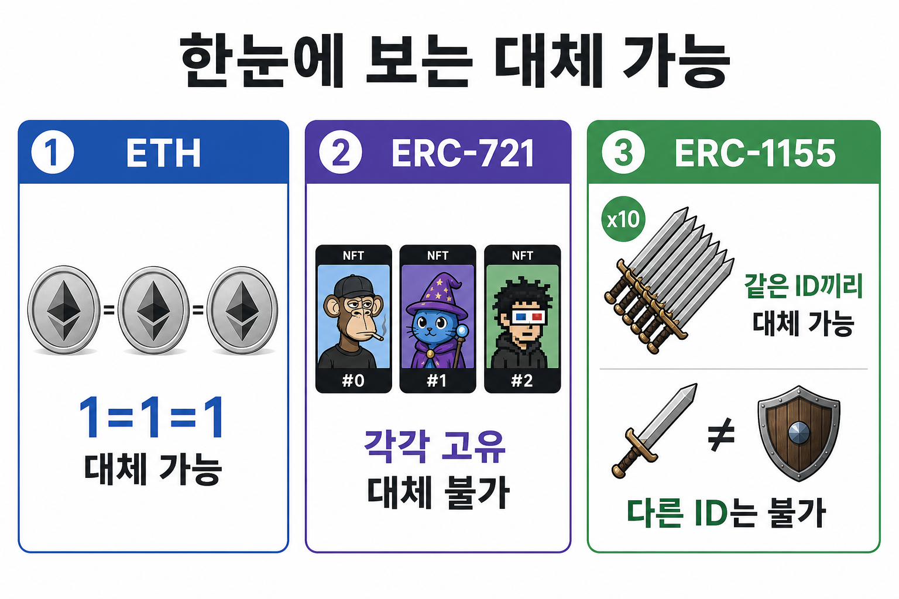
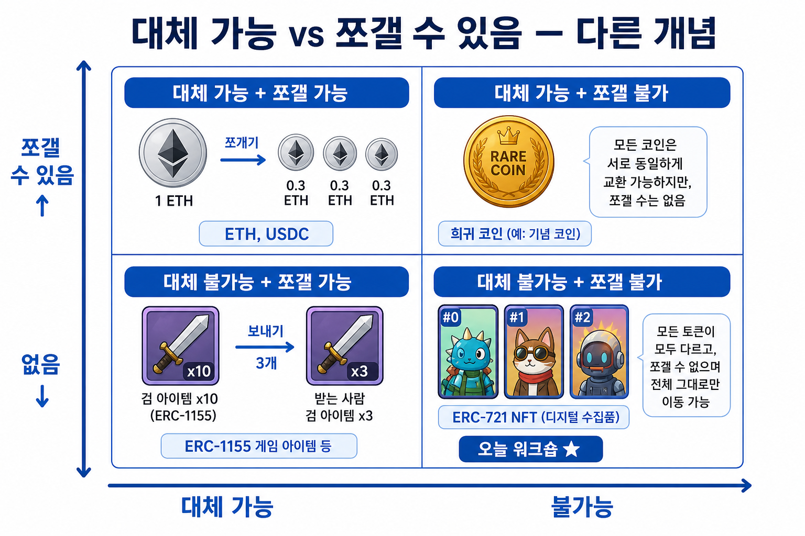
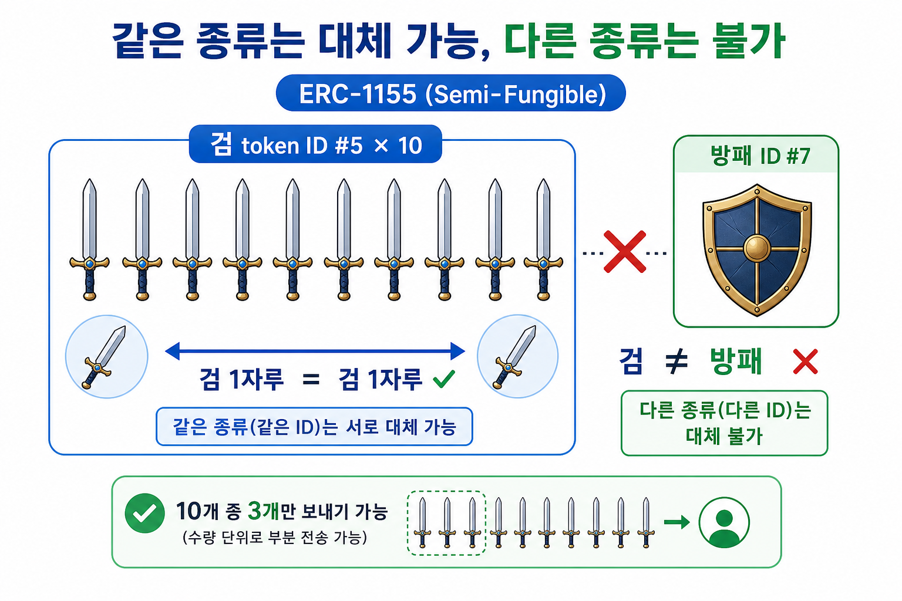
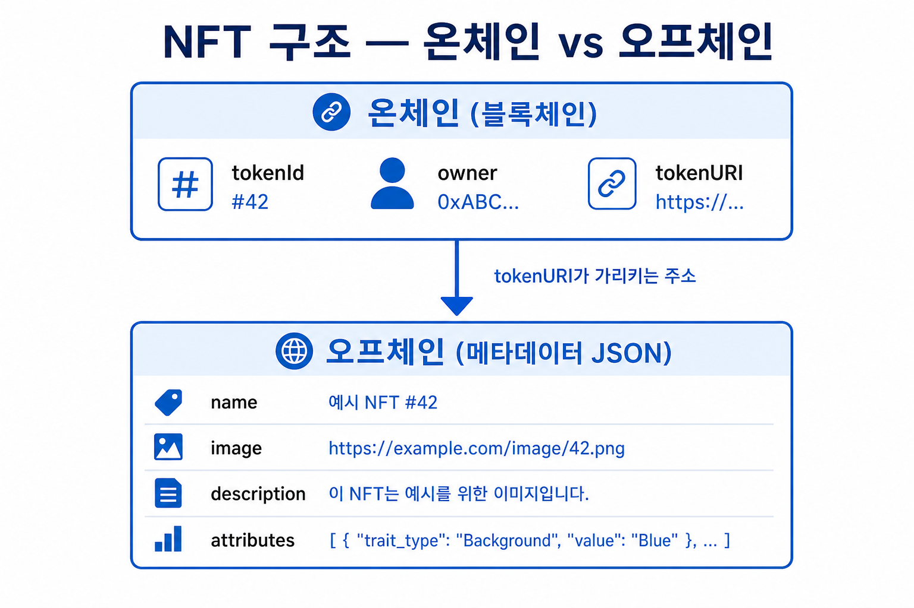
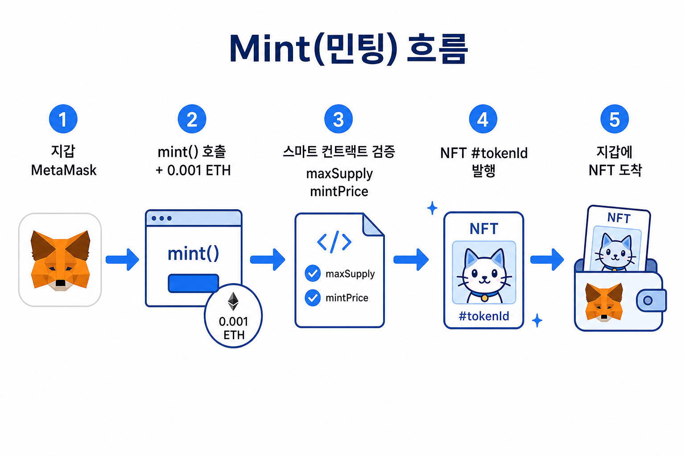
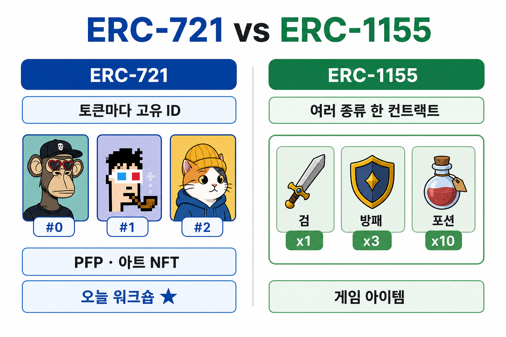
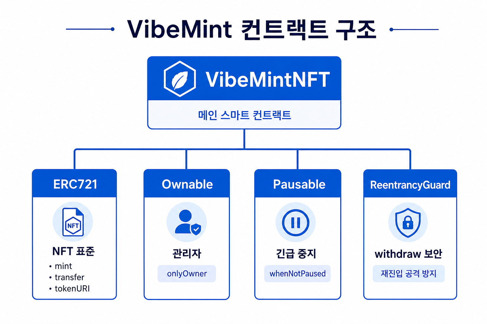

# 01. NFT 스마트 컨트랙트 이해

## 학습 목표

- **NFT가 무엇인지** 일상 언어로 설명할 수 있다
- **대체 가능 vs 쪼갤 수 있음** 차이를 구분한다
- **ERC-721 vs ERC-1155** 차이를 이해한다
- OpenZeppelin ERC721 기본 구조를 안다
- AI로 컨트랙트 **역분석** 실습

---

## 1. NFT란? (먼저 이해하기)

### NFT = Non-Fungible Token (대체 불가능한 토큰)

| 구분 | 설명 | 예시 |
| --- | --- | --- |
| **대체 가능** (Fungible · **펀저블**) | 서로 바꿔도 **가치·쓰임이 같음** | 내 1 ETH ↔ 남의 1 ETH |
| **대체 불가능** (Non-Fungible) | 각각 고유함 | NFT #3 ↔ #7 (가치 다를 수 있음) |

**한 줄 정리**: NFT는 블록체인에 **「이 디지털 자산의 주인이 누구인지」** 기록해 두는 **디지털 소유권 증명**입니다.

### 대체 가능 vs 쪼갤 수 있음 — 같은 말이 아닙니다

헷갈리기 쉬운 **두 가지 질문**을 구분합니다.

| 개념 | 영어 | 묻는 것 | 예 |
| --- | --- | --- | --- |
| **대체 가능 / 불가능** | Fungible | **서로 바꿔도 되나?** | 1 ETH ↔ 1 ETH (됨) · NFT #1 ↔ #2 (안 됨) |
| **쪼갤 수 있음 / 없음** | Divisible | **잘라서 일부만 줄 수 있나?** | 1 ETH → 0.001 ETH (됨) · NFT #5 “반쪽” (안 됨) |

| | **쪼갤 수 있음** | **쪼갤 수 없음** |
| --- | --- | --- |
| **대체 가능** | ETH, USDC (같은 종류·나눠서 전송) | 희귀 동전 1호 한 장 (같은 종류라도 그 장은 통째로) |
| **대체 불가능** | ERC-1155 (검 10자루 중 3자루만 전송) | **ERC-721 NFT** (#0, #1 — 통째로만, **오늘 워크숍 ★**) |

**수업용 한 줄**:

> **대체 불가능** = “이 NFT와 저 NFT는 서로 바꿀 수 없다”  
> **쪼갤 수 없음** = “NFT #3을 반만 보낼 수 없다”  
> 둘 다 NFT에 자주 해당하지만, **같은 말은 아닙니다.**

### NFT에 무엇이 담기나?

| 위치 | 저장 내용 | 특징 |
| --- | --- | --- |
| **온체인** | tokenId, owner, tokenURI(링크) | 소유권·거래 기록, 위조 어려움 |
| **오프체인** | name, image, description, attributes | IPFS·웹 URL에 JSON 저장 |

### NFT로 할 수 있는 것 — Mint(민팅) 흐름

| 할 수 있는 것 | 설명 |
| --- | --- |
| **민팅(Mint)** | 새 NFT 발행 — **오늘 실습 핵심** |
| **소유·전송** | 지갑 간 NFT 보내기 |
| **거래** | OpenSea 등 마켓에서 사고팔기 |
| **조건 부여** | 화이트리스트, 가격, 수량 제한 (컨트랙트로 구현) |

### 왜 스마트 컨트랙트가 필요한가?

NFT 규칙을 **코드로 고정**하기 위해서입니다.

| 사람이 정하는 규칙 | 컨트랙트가 하는 일 |
| --- | --- |
| "최대 100개만 발행" | `maxSupply = 100` |
| "0.001 ETH 내야 mint" | `mintPrice` 검증 |
| "지갑당 3개까지만" | `mintedCount` cap |
| "긴급 중지" | `pause()` |

> 오늘 만드는 **VibeMint**도 이 규칙들을 스마트 컨트랙트에 담습니다.

---

## 2. ERC 표준 (NFT를 코드로 만드는 규칙)

블록체인 위에서 NFT를 만들려면 **공통 규칙(표준)**이 필요합니다.  
이더리움에서는 **ERC(Ethereum Request for Comments)** 로 표준이 정해져 있습니다.

### ERC란?

- **E**thereum **R**equest for **C**omments
- 지갑·마켓·앱이 모두 이해할 수 있는 **약속된 인터페이스**
- ERC-20 = 대체 가능 토큰 (일반 코인)
- **ERC-721** = 대체 불가 NFT ← **오늘 사용**
- **ERC-1155** = 한 컨트랙트에 여러 종류 토큰

### ERC-721 vs ERC-1155

| | ERC-721 | ERC-1155 |
| --- | --- | --- |
| **단위** | 토큰마다 고유 ID (#0, #1, …) | 한 컨트랙트에 여러 token type |
| **비유** | 명화 한 점 한 점 | 게임 인벤토리 (검 1개, 방패 3개) |
| **대표 사용** | PFP, 아트 NFT (BAYC, Azuki) | 게임 아이템, 다종류 에셋 |
| **본 워크숍** | **★ 사용** | 개념만 |

### ERC-721 핵심 함수 (꼭 알아둘 것)

| 함수 | 하는 일 |
| --- | --- |
| `balanceOf(owner)` | 이 지갑이 NFT 몇 개 보유? |
| `ownerOf(tokenId)` | 이 번호 NFT 주인은 누구? |
| `safeTransferFrom` | NFT를 안전하게 전송 |
| `tokenURI(tokenId)` | 메타데이터 JSON 주소 (이미지·이름) |
| `approve` / `setApprovalForAll` | 마켓(OpenSea)이 대신 옮기도록 허용 |

### OpenZeppelin — 검증된 ERC 구현체

직접 ERC-721 전체를 짜기보다, **OpenZeppelin** 라이브러리를 씁니다.

| 모듈 | 역할 |
| --- | --- |
| ERC721 | mint, transfer, tokenURI 등 NFT 기본 |
| Ownable | `onlyOwner` — 배포자만 설정 변경 |
| Pausable | `whenNotPaused` — 긴급 시 mint 중지 |
| ReentrancyGuard | `withdraw` 보안 |

---

## 3. 실습: AI 역분석

NFT·ERC 개념을 익혔다면, 이제 **완성된 컨트랙트**를 AI로 읽어 봅니다.

1. Cursor에서 `contracts/solution/VibeMintNFT.sol` 열기
2. [01-reverse-engineer.md](../prompts/01-reverse-engineer.md) 프롬프트 복붙
3. 결과를 노트에 정리 — **Spec 작성 예습**

### 스스로 확인

- [ ] **대체 불가능**과 **쪼갤 수 없음**이 같은 말이 아님을 설명할 수 있다
- [ ] NFT와 ERC-721의 관계를 한 문장으로 설명할 수 있다
- [ ] public mint와 whitelist mint 차이를 설명할 수 있다
- [ ] `pause()`가 호출되면 어떤 함수가 막히는지 안다
- [ ] `maxSupply`와 `mintedCount` 역할을 구분한다

---

## 이미지 한눈에 보기

| 그림 | 파일 |
| --- | --- |
| 대체 가능 vs NFT | [nft-fungible-vs-nonfungible.png](images/nft-fungible-vs-nonfungible.png) |
| **가치 같음 = 대체 가능 (ETH)** | [fungible-value-same.png](images/fungible-value-same.png) |
| **ETH · 721 · 1155 비교** | [fungible-three-types.png](images/fungible-three-types.png) |
| **ERC-1155 세미펀저블** | [erc1155-semi-fungible.png](images/erc1155-semi-fungible.png) |
| **대체 가능 vs 쪼갤 수 있음 (4분면)** | [fungible-divisible-matrix.png](images/fungible-divisible-matrix.png) |
| 온체인 / 오프체인 | [nft-onchain-offchain.png](images/nft-onchain-offchain.png) |
| Mint 흐름 | [nft-mint-flow.png](images/nft-mint-flow.png) |
| ERC-721 vs 1155 | [erc721-vs-erc1155.png](images/erc721-vs-erc1155.png) |
| VibeMint 구조 | [vibemint-architecture.png](images/vibemint-architecture.png) |

---

## 다음

→ [02-spec-writing.md](02-spec-writing.md)
