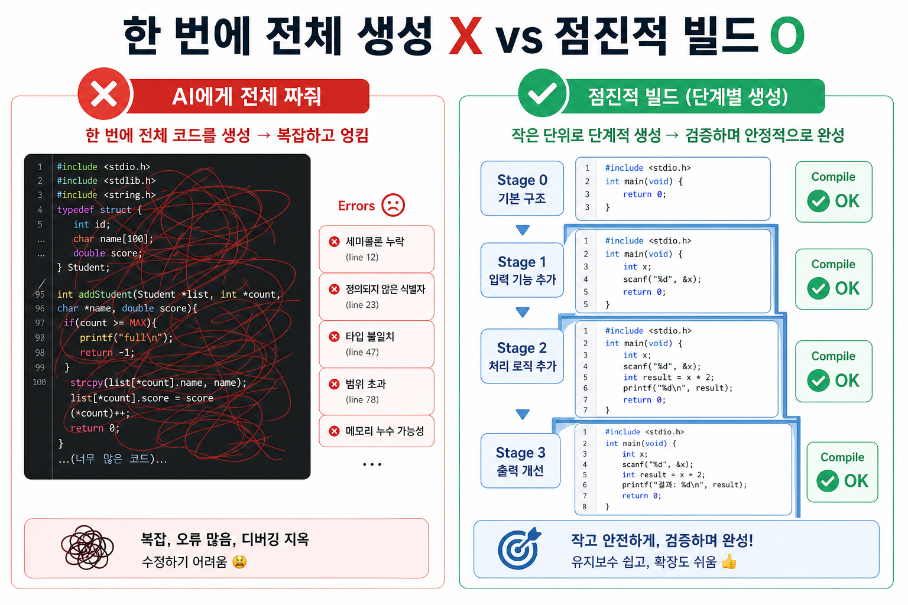
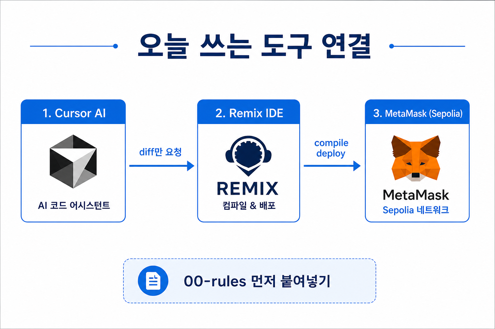
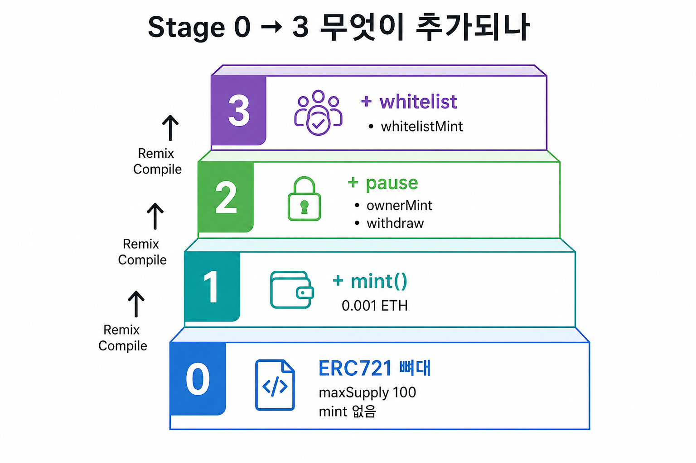
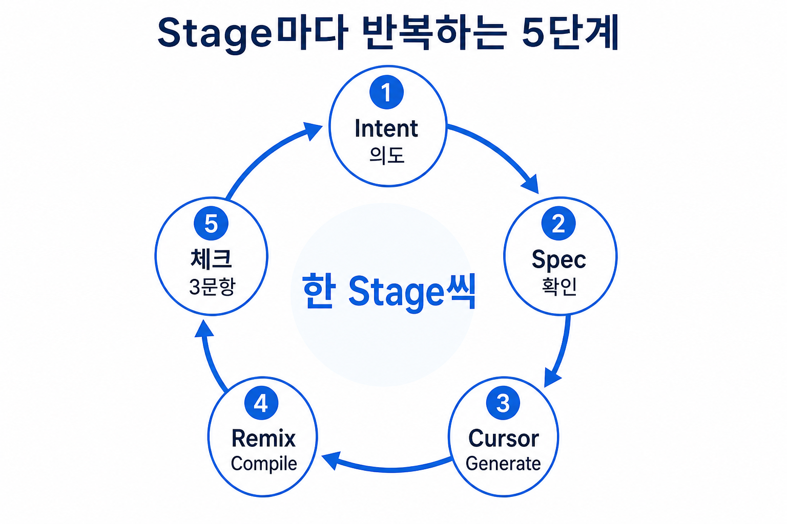
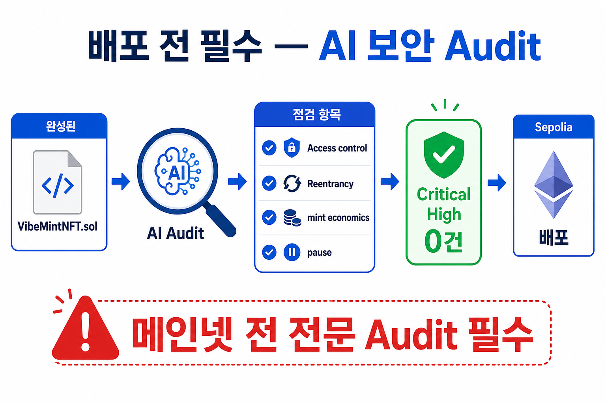

# 03. 점진적 NFT 컨트랙트 빌드

이 문서는 **오후 실습의 핵심**입니다.  
Cursor로 코드를 **한 단계씩** 만들고, Remix에서 **눌러보며** 확인하는 방법을 쉽게 정리했습니다.

> **한 줄**: 「NFT 전부 만들어줘」가 아니라, **Stage 0 → 1 → 2 → 3**으로 **기능만 추가**합니다.

---

## 학습 목표

이 장을 끝내면 다음을 할 수 있어야 합니다.

- [ ] **점진적 빌드**가 왜 안전한지 말로 설명할 수 있다
- [ ] Stage 0 → 3 순서로 Cursor + Remix 실습을 끝낸다
- [ ] 코드를 고칠 때마다 **Compile → (필요하면) Deploy** 하는 습관을 들인다
- [ ] 배포 전 **AI 보안 Audit**을 1회 실행하고 Critical/High를 고친다

**대략 시간**: Stage 빌드 60분 + Audit 15분 (현장 속도에 맞게 조절)

---

## 1. 점진적 빌드란? (먼저 이해하기)

### 비유: 집을 한 번에 짓지 않기

| 방식 | 비유 | 결과 |
| --- | --- | --- |
| **한 번에 전체 생성** ❌ | “집 전체를 하루 만에 지어줘” | 어디가 무너졌는지 모름 |
| **점진적 빌드** ✅ | 기초 → 벽 → 문·창문 → 잠금장치 | 단계마다 확인하고 다음으로 |

AI에게도 같습니다.  
**작업을 나눠서** 시키고, **매번 Compile**로 “여기까지는 OK”를 확인합니다.

### 한 번에 vs 한 단계씩



| 방식 | 하는 일 | 자주 생기는 문제 |
| --- | --- | --- |
| **한 번에 전체 생성** ❌ | “NFT 컨트랙트 전부 짜줘” | AI가 꼬임, 보안 누락, 어디서 틀렸는지 모름 |
| **점진적 빌드** ✅ | Stage 0 → 1 → 2 → 3 **기능만 추가** | 문제 지점이 명확, Audit·디버깅이 쉬움 |

**한 줄 정리**: AI를 **주니어 개발자**처럼 대하세요.  
“다 해줘”가 아니라 **“이번엔 mint만 추가해줘”**라고 시킵니다.

### 오늘 쓰는 도구 (역할만 기억)



| 도구 | 쉬운 말 | 오늘 하는 일 |
| --- | --- | --- |
| **Cursor** | AI 코딩 에디터 | Stage 프롬프트로 **코드 diff** 받기 |
| **Remix** | 브라우저 Solidity 실험실 | **컴파일·배포·함수 클릭 테스트** |
| **MetaMask** | 지갑 | Stage 연습에는 거의 안 씀 → **나중에 Sepolia 배포** 때 |

> Stage 0~3 테스트는 **Remix VM**(가짜 체인)으로 합니다.  
> MetaMask·Faucet은 [04-deploy-sepolia.md](04-deploy-sepolia.md)에서 본격 사용합니다.

### 자주 나오는 용어 (먼저 익히기)

| 용어 | 쉬운 설명 |
| --- | --- |
| **diff** | “전체 파일 새로 쓰기”가 아니라 **바뀐 부분만** 추가 |
| **Compile** | 코드를 Remix가 이해할 수 있는 형태로 변환. **초록 체크 = 문법 OK** |
| **Deploy** | 컨트랙트를 (연습용) 체인에 **올려서** 함수를 누를 수 있게 함 |
| **revert** | `require` 조건에 걸려 **트랜잭션이 거절**됨. (의도한 실패도 테스트 성공!) |
| **payable** | 함수 호출 시 **ETH를 함께 보낼 수 있음** (mint에 필요) |
| **onlyOwner** | **배포한 사람(관리자)**만 호출 가능 |
| **pause** | 긴급 상황 때 mint를 **일시 중지** |

---

## 2. Stage 0 → 3 — 무엇이 쌓이나?



각 Stage는 **이전 코드를 유지한 채** 기능만 얹습니다.

| Stage | 한 줄 요약 | 새로 생기는 것 | 아직 없는 것 |
| --- | --- | --- | --- |
| **0** | NFT **뼈대** | ERC721, Ownable, maxSupply=100, tokenURI | mint |
| **1** | **민팅** | `mint()` + 0.001 ETH + 지갑당 3개 | pause, whitelist |
| **2** | **관리·안전** | pause, ownerMint, withdraw | whitelist |
| **3** | **화이트리스트** | whitelist + `whitelistMint()` | — (완성) |

### 왜 mint를 Stage 0에 안 넣나?

뼈대만 먼저 올리면:

1. OpenZeppelin import·이름·owner가 **맞는지** 확인하기 쉽고  
2. mint 버그가 생겨도 “Stage 1에서 생겼다”고 **범위를 좁힐 수** 있습니다.

> **기억**: Stage 0에는 **`mint` 버튼이 없습니다.** Stage 1부터 생깁니다.

### Spec과의 연결

오전 [02-spec-writing.md](02-spec-writing.md)에서 정한 값과 맞춰 갑니다.

| Spec 항목 | Stage에서 나타나는 때 |
| --- | --- |
| maxSupply 100, 이름 VibeMint | Stage 0 |
| mintPrice 0.001 ETH, 지갑당 3개 | Stage 1 |
| pause, withdraw, ownerMint | Stage 2 |
| whitelist | Stage 3 |

---

## 3. Stage마다 반복하는 5단계



매 Stage마다 **같은 루프**를 돌립니다.

```text
Intent → Spec 확인 → Cursor Generate → Remix Compile → 체크 3문항
         (필요하면 Deploy + 함수 테스트)
```

| 단계 | 하는 일 | 예시 (Stage 1) |
| --- | --- | --- |
| **1. Intent** | “이번엔 이것만” 한 문장 | “Stage 0에 mint만 추가” |
| **2. Spec** | 오전 Spec / Stage 프롬프트와 맞는지 확인 | 0.001 ETH, cap 3 |
| **3. Generate** | **00-rules** + Stage 프롬프트 → Cursor | `@VibeMintNFT.sol` 멘션 |
| **4. Compile** | Remix **0.8.31** · EVM **osaka** · 에러 0 | 초록 체크 |
| **5. 체크** | 아래 Stage별 3문항 + Remix 클릭 테스트 | Value 0.001 → mint |

### Cursor에서 하는 일 (공통)

1. 채팅을 열고 **먼저** [00-rules.md](../prompts/00-rules.md) 붙여넣기  
2. `@VibeMintNFT.sol` 로 **현재 파일** 멘션 (Stage 1부터 특히 중요)  
3. 해당 Stage 프롬프트의 **복붙용 프롬프트** 실행  
4. AI가 **전체 파일을 새로 쓰면** 중단하고 “Stage N **diff만**” 다시 요청  
5. 나온 코드를 Remix의 `VibeMintNFT.sol`에 반영 → 저장

### Remix에서 하는 일 (공통)

자세한 버튼 설명은 [stage-build README](../prompts/03-stage-build/README.md)에 있습니다. 최소 기억할 것:

| 할 일 | 위치 | 팁 |
| --- | --- | --- |
| 파일 붙여넣기 | File Explorer | 파일명 `VibeMintNFT.sol` |
| Compile | Solidity Compiler | **0.8.31** · EVM **osaka** |
| Environment | Deploy & Run | **Remix VM** (Injected Provider 아님) |
| Deploy | Deploy 버튼 | 코드 고치면 **다시 Compile → 다시 Deploy** |
| 읽기 / 쓰기 | 파란 / 주황 버튼 | mint는 **Value = 0.001 ether** 후 transact |

---

## 4. 시작 전 준비 (3가지)

실습 시작 전에 이것만 준비하세요.

### ① AI 규칙 (필수)

[00-rules.md](../prompts/00-rules.md)를 Cursor **첫 메시지**에 붙여넣습니다.

핵심만 다시 말하면:

- 한 번에 **전체 재작성 금지**
- **OpenZeppelin**만 사용
- **요청한 Stage diff만** 추가
- Sepolia **교육용** (메인넷 가정 금지)

### ② Remix 파일

1. [remix.ethereum.org](https://remix.ethereum.org) 접속  
2. `contracts` 폴더에 **`VibeMintNFT.sol`** 생성  
3. Cursor 코드를 붙여넣고 저장 (`Cmd/Ctrl + S`)

### ③ 참고 코드 · 프롬프트

막히면 **정답 Stage 폴더**와 비교하고, 평소에는 **프롬프트**로 진행합니다.

| Stage | 참고 폴더 | Cursor 프롬프트 |
| --- | --- | --- |
| 0 | [stage-0-base](../../contracts/stages/stage-0-base/) | [stage-0.md](../prompts/03-stage-build/stage-0.md) |
| 1 | [stage-1-mint](../../contracts/stages/stage-1-mint/) | [stage-1.md](../prompts/03-stage-build/stage-1.md) |
| 2 | [stage-2-access](../../contracts/stages/stage-2-access/) | [stage-2.md](../prompts/03-stage-build/stage-2.md) |
| 3 | [stage-3-whitelist](../../contracts/stages/stage-3-whitelist/) | [stage-3.md](../prompts/03-stage-build/stage-3.md) |

**Remix 사용법 · Stage별 상세 체크리스트**  
→ [../prompts/03-stage-build/README.md](../prompts/03-stage-build/README.md)

---

## 5. Stage별 따라하기

각 Stage는 **Intent → Cursor → Remix → 체크** 순서로 진행합니다.

---

### Stage 0 — ERC-721 뼈대 (약 20분)

**Intent**  
> “VibeMint 이름의 ERC-721 **뼈대만**. mint는 아직 없음.”

#### 이 Stage에서 배우는 것

- NFT 컬렉션의 **이름·심볼·최대 발행량**
- **owner**(배포자)만 관리 함수를 쓸 수 있음 (`setBaseURI`)
- mint 없이도 Compile·Deploy·Read가 가능하다는 것

#### 따라하기

1. Remix에 `VibeMintNFT.sol` 생성  
2. Cursor에 **00-rules** + [stage-0.md](../prompts/03-stage-build/stage-0.md) 실행 → 코드 반영  
3. Remix **Compile** (Solidity **0.8.31** · EVM **osaka**) → 초록 체크  
4. Environment = **Remix VM** → **Deploy**  
5. 파란색으로 `name`, `symbol`, `maxSupply`, `owner`, `totalMinted` 확인  
6. 주황색 `setBaseURI`에 URL 입력 → **transact** (Account #0)  
7. Account #1로 `setBaseURI` → **revert** 확인 (owner만 가능)  
8. 목록에 **`mint`가 없는지** 확인  

막히면 → `contracts/stages/stage-0-base/VibeMintNFT.sol` 과 비교

#### Remix에서 기대하는 값

| 확인 | 기대 |
| --- | --- |
| `name` / `symbol` | VibeMint / VMINT |
| `maxSupply` | 100 |
| `totalMinted` | 0 |
| `tokenURI(0)` | **revert** (아직 NFT 없음) |
| `mint` 버튼 | **없음** |

#### 체크 3문항

- [ ] `setBaseURI`는 **owner만**? (다른 Account면 revert)
- [ ] `maxSupply` = **100**?
- [ ] 불필요한 `payable` / 입금 함수가 **없음**?

**한 줄**: Stage 0 = 「공장 건물만 세움. 제품(NFT)은 아직 0개」

---

### Stage 1 — Public Mint (약 20분)

**Intent**  
> “Stage 0에 `mint()` payable만 추가. 나머지 유지.”

#### 이 Stage에서 배우는 것

- 유저가 **0.001 ETH**를 내고 NFT를 받음
- **최대 100개**, **지갑당 3개** 제한
- `msg.value`가 모자라면 **revert**

#### 따라하기

1. Cursor에서 `@VibeMintNFT.sol` 멘션  
2. [stage-1.md](../prompts/03-stage-build/stage-1.md) 실행  
3. **전체 재작성 금지** — mint 관련만 추가됐는지 확인  
4. Remix **재Compile → 재Deploy** (옛 배포본은 Stage 0 코드!)  
5. Deploy 패널 **Value** = `0.001` ether (소수 입력 안 되면 **wei** `1000000000000000` — [04-deploy-sepolia.md §4](04-deploy-sepolia.md#eth-단위-ether--gwei--wei))  
6. 주황색 `mint` → **transact**  
7. 파란색 확인: `totalMinted` = 1, `ownerOf(0)` = 내 주소  
8. Value `0`으로 mint → **revert**  
9. 같은 계정으로 mint **3회** 성공 후 **4번째** → **revert**

#### 자주 하는 실수

| 실수 | 해결 |
| --- | --- |
| `0.001` 입력 시 `001`·`0`으로 바뀜 | 단위 **wei** → `1000000000000000` ([04 §4](04-deploy-sepolia.md#remix-value-입력-소수점-버그-우회)) |
| Value에 **3** 입력 (MAX_PER_WALLET 혼동) | mint 가격은 **0.001** ether만 |
| 코드만 고치고 옛 Deploy 사용 | **재Compile + 재Deploy** |
| AI가 파일 통째로 다시 씀 | “Stage 1 **diff만**” 재요청 |

#### 체크 3문항

- [ ] `msg.value` 검증이 있는가?
- [ ] `totalMinted` < `maxSupply` 검사가 있는가?
- [ ] `_safeMint`를 사용하는가?

**한 줄**: Stage 1 = 「손님이 ETH를 내고 NFT를 받아 가는 창구」

---

### Stage 2 — Pause · Owner · Withdraw (약 25분)

**Intent**  
> “Pausable, ownerMint, withdraw 추가.”

#### 이 Stage에서 배우는 것

| 기능 | 쉬운 설명 |
| --- | --- |
| **pause / unpause** | 비상벨 — mint를 잠시 멈춤 |
| **ownerMint** | 관리자가 **ETH 없이** 일부 NFT 발행 (이벤트·팀용) |
| **withdraw** | mint로 모인 ETH를 **owner 지갑으로 인출** |
| **publicMint 토글** | public mint 문을 열고 닫기 |

보안 포인트:

- `withdraw`는 **owner만**, 가능하면 **ReentrancyGuard** + **CEI** 순서  
  (먼저 상태 정리 → 그다음 ETH 전송)

#### 따라하기

1. [stage-2.md](../prompts/03-stage-build/stage-2.md) 실행 (00-rules + `@` 멘션)  
2. **재Compile → 재Deploy**  
3. `pause()` 호출 후 `mint` → **revert** 확인  
4. `unpause()` 후 mint 다시 성공하는지 확인  
5. `ownerMint(내주소, 1)` — Value **0**으로 성공  
6. Account #1에서 `ownerMint` / `withdraw` → **revert**  
7. mint로 ETH를 쌓은 뒤 Account #0에서 `withdraw` 성공

#### 체크 3문항

- [ ] withdraw에 **reentrancy** 대비가 있는가?
- [ ] pause 시 mint가 **멈추는가**?
- [ ] withdraw가 **CEI 순서**(상태 먼저, 전송 나중)인가?

**한 줄**: Stage 2 = 「비상 정지 + 관리자 발행 + 매출 인출」

---

### Stage 3 — Whitelist (약 25분)

**Intent**  
> “whitelist mapping + `whitelistMint()` 추가.”

#### 이 Stage에서 배우는 것

- **화이트리스트** = 미리 허용된 주소만 민팅  
- public mint를 꺼도 (`setPublicMintEnabled(false)`)  
  **whitelist mint는 가능**한 경우가 많음 (Spec에 따름)  
- pause는 **모든 mint**에 공통으로 걸림

#### 따라하기

1. [stage-3.md](../prompts/03-stage-build/stage-3.md) 실행  
2. **재Compile → 재Deploy**  
3. `setWhitelist([내주소], true)` (owner)  
4. `whitelist(내주소)` → `true` 확인  
5. `setPublicMintEnabled(false)` → public `mint` **revert**  
6. Value 0.001 → `whitelistMint` **성공**  
7. Account #1(미등록) → `whitelistMint` **revert**  
8. pause 후 `whitelistMint`도 **revert**인지 확인

#### 체크 3문항

- [ ] 비화이트리스트가 `whitelistMint`하면 **revert**?
- [ ] `setWhitelist`에 **batch 길이 제한** 등이 있는가? (남용 방지)
- [ ] Stage 2의 pause / withdraw가 **여전히** 동작하는가?

**⏱ 시간 부족 시**  
Stage 3을 생략하고 [solution](../../contracts/solution/VibeMintNFT.sol)을 참고해도 됩니다.  
다만 **Audit은 solution이든 본인 코드든 반드시** 돌리세요.

**한 줄**: Stage 3 = 「초대받은 사람만 입장하는 VIP 창구」

---

## 6. 배포 전 AI 보안 Audit (필수 · 약 15분)



Stage 3(또는 solution)까지 끝난 뒤, **Sepolia에 올리기 전**에 Review를 합니다.

### 왜 필수인가?

AI가 만든 코드에도 **접근 제어 누락·재진입·가격 검증 실수**가 자주 납니다.  
테스트넷이라도 **“Review 없이 Ship”** 하지 않는 습관을 오늘의 목표로 둡니다.

### 따라하기

1. Cursor에 `@VibeMintNFT.sol` + [04-security-audit.md](../prompts/04-security-audit.md)  
2. 나온 **findings 표**에서 **Critical / High**만 골라 수정  
3. 수정은 **diff만** (전체 재작성 금지)  
4. Remix **Recompile** (+ 짧게 mint/pause/withdraw 재테스트)

### 합격 기준

| 등급 | 기준 |
| --- | --- |
| **Critical** | **0건** |
| **High** | **0건** (또는 수정 완료) |

> 오늘 코드는 **Sepolia 테스트넷 교육용**입니다.  
> **메인넷**에 올리려면 반드시 **전문 Audit**이 필요합니다.

---

## 7. 막혔을 때

| 증상 | 먼저 시도할 해결 |
| --- | --- |
| AI가 전체 파일을 다시 씀 | 00-rules + “Stage N **diff만**. 기존 삭제 금지” |
| Compile 에러 | Compiler **0.8.31** · EVM **osaka**, OZ `@5.1.0` import, 오타 확인 |
| 코드는 고쳤는데 예전처럼 동작 | **재Compile + 재Deploy** |
| mint가 계속 revert | Value **0.001 ether**인지, pause/public 꺼짐인지 확인 |
| owner 함수가 안 됨 | Account를 **배포한 #0**으로 |
| 그래도 실패 | [troubleshooting.md](../instructor/troubleshooting.md) |
| 정답과 비교 | [VibeMintNFT.sol](../../contracts/solution/VibeMintNFT.sol) |

### 스스로 점검하는 질문

1. 지금 Environment가 **Remix VM**인가?  
2. 방금 고친 코드로 **다시 Deploy**했는가?  
3. Intent가 “이번 Stage만”으로 **좁혀져** 있는가?

---

## 8. 이 장 마무리 체크리스트

- [ ] Stage 0 Compile·Deploy·`setBaseURI` owner 테스트 완료  
- [ ] Stage 1 mint (0.001 ETH) · 지갑당 3개 cap 확인  
- [ ] Stage 2 pause / ownerMint / withdraw 확인  
- [ ] Stage 3 whitelist (또는 solution 대체)  
- [ ] AI Audit Critical/High **0건**  
- [ ] 다음 문서([04-deploy-sepolia.md](04-deploy-sepolia.md))로 갈 준비 완료  

---

## 이미지 한눈에 보기

| 그림 | 파일 |
| --- | --- |
| 한 번에 vs 점진적 | [incremental-vs-all-at-once.png](images/incremental-vs-all-at-once.png) |
| 도구 흐름 | [incremental-tools-flow.png](images/incremental-tools-flow.png) |
| Stage 0→3 | [stage-0-to-3-detail.png](images/stage-0-to-3-detail.png) |
| Stage 반복 5단계 | [stage-repeat-loop.png](images/stage-repeat-loop.png) |
| 보안 Audit | [security-audit-before-deploy.png](images/security-audit-before-deploy.png) |

---

## 다음

→ [04-deploy-sepolia.md](04-deploy-sepolia.md) — Audit 통과 후 **Injected Provider**로 Sepolia 배포 · mint
